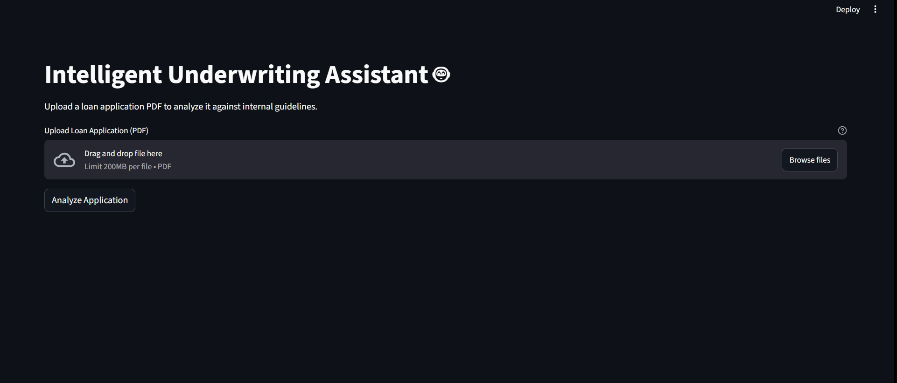

# 🤖 Intelligent Underwriting Assistant

A full-stack AI application that leverages Large Language Models to automate the initial risk analysis of loan applications, helping underwriters make faster and more consistent decisions.

---

## 🎥 Project Demo

*Please find attached a small clip of how the intelligenct underwriting assistant works.*
 

---

## 🎯 The Problem

Loan and insurance underwriters spend hours manually reviewing unstructured documents like business plans and personal statements. This process is slow, subjective, and prone to human error, leading to delays and inconsistent risk assessment. This project aims to solve that problem by providing an AI-powered first-pass analysis.

---

## 🛠️ Tech Stack & Architecture

This project is a full-stack, containerized application built with a modern Python-based stack.

* **Frontend:** `Streamlit`
* **Backend:** `FastAPI`
* **AI Orchestration:** `LangChain`
* **LLM:** Open-source `Mistral 7B` served locally via `Ollama`
* **Vector Database:** `ChromaDB` (in-memory) for RAG
* **Containerization:** `Docker` & `Docker Compose`

### Architecture Diagram

The application follows a simple, scalable microservice architecture. The frontend is decoupled from the backend, which allows them to be developed, deployed, and scaled independently.


---

## 🚀 How to Run Locally

This project is fully containerized, so running it is incredibly simple.

**Prerequisites:**
* [Docker Desktop](https://www.docker.com/products/docker-desktop/) installed and running.
* [Ollama](https://ollama.com/) installed and running with the `mistral` model (`ollama pull mistral`).
* `git` for cloning the repository.

**Instructions:**

1.  **Clone the repository:**
    ```bash
    git clone [https://github.com/YOUR_USERNAME/YOUR_REPO_NAME.git](https://github.com/YOUR_USERNAME/YOUR_REPO_NAME.git)
    cd intelligent-underwriting-assistant
    ```

2.  **Launch the application:**
    ```bash
    docker-compose up --build
    ```

3.  **Access the application:**
    * The **Frontend** will be available at `http://localhost:8501`.
    * The **Backend API Docs** will be available at `http://localhost:8000/docs`.

---

## 📈 Future Improvements (Week 2 Plan)

* **Public Deployment:** Deploy the FastAPI backend to a free cloud service like Render and the Streamlit frontend to Streamlit Community Cloud.
* **Enhanced RAG:** Refine the prompt engineering and test against a wider variety of guidelines and applications.
* **User Authentication:** Add a simple login system to manage user sessions.
